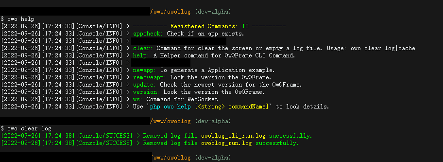

# OwOFrame

  [Learn More](https://opensource.org/licenses/Apache-2.0)

OwO! 欢迎来到本项目. `OwOFrame` 基于 `MVC (Model-Views-Controller)` 模式开发, 框架的制定标准一定程度借鉴了 目前流行的PHP-MVC框架. 此项目仅为我个人的练习项目.  

如果您觉得本项目对您有帮助, 请给本项目一颗小小的 `Star` 呗QWQ

项目打赏/捐赠地址: <https://owoblog.com/donation/>

[英文版简介请点这里](README.md)

## 我能做什么?

OwOFrame 是我利用个人的空闲时间以及数不尽多少天熬夜开发出来的小框架, 当然也有很多不足之处. 本框架目前支持的功能请参见下列:

### 基础系统组件

- [x] `!!!IDE友好!!!`       所有注释都能在 `Visual Studio Code` 中获得良好的显示效果
- [x] `Application`         本框架为多应用共存框架, 通过 `HTTP_URI` 识别当前的应用
- [x] `Console`             支持在终端通过 `CommandLine` 实现一些操作
- [x] `Config`              配置文件解析类
- [x] `EventManager`        事件管理器 (钩子方法)
- [x] `Exception`           错误异常抓取及Stack输出
- [x] `ModuleLoader`        模块加载器 (独立于应用程序之外且可灵活管理, 处于全局模式下)
- [x] `Language`            ~~自定义语言包支持~~ (重写中)
- [x] `Logger`              支持最基础的日志记录
- [x] `Redis`               ~~支持基本Redis操作~~ (重写中)
- [x] `Route`               路由解析/管理 (个性化的路由绑定设置)
- [x] `Template`            后端渲染模板 (基本功能已经完成, 龟速开发进阶功能o(*￣▽￣*)o)
- [x] `TextColorOutput`     支持ANSI控制码在CMD & Shell输出色彩
- [x] `WMI`                 针对Windows系统编写的WMI操作类
- [x] `Cookie`              一个普通的Cookie处理类
- [x] `Session`             一个普通的Session处理类
- [x] `EmptyAppGenerator`   一键生成新的应用程序模板
- [x] `FileUploader`        文件上传类支持
- [x] `systemFunctions`     一个集成了系统底层的文件函数 (具体请看源代码)
- [x] `httpFunctions`       一个集成了HTTP底层的文件函数 (具体请看源代码)

### 第三方资源

- [x] [`PasswordHash`](http://www.openwall.com/phpass/) 在此项目中包含/集成了该类库
- [x] [`Think-ORM`](https://github.com/top-think/think-orm) 使用此项目达到了OwOFrame的ModelBase目的实现

## 如何使用?

### §1 安装方法

- 可以使用 `git clone https://github.com/Tommy131/OwOFrame.git` 方法直接将项目克隆到本地.  
- 或使用 `composer create-project tommy131/owoframe -s dev` 将本项目在本地创建.

### §2 命令行运行方法

打开命令行 `CMD` 或Linux的 `Shell` 之后, 进入到项目根目录并且输入指令 `cd owoframe && composer install` 安装所需的依赖包.  
如果你选择的第二种安装方法, 则不需要执行上述命令.

### §3 目录格式

- 引导文件为根目录下的 `/public/index.php`, 通过此文件初始化框架.

### 是否需要修改Web环境?

需要. Nginx的修改方法参考下方:

``` nginx
# Set your web root path to /public (Example);
root /www/owoframe/public;

location / {
    index index.php index.html;
    try_files $uri $uri/ /index.php$is_args$query_string;
}
```

### 如何在CLI模式下运行OwOFrame?

打开命令行 `CMD` 或任意终端之后, 进入OwOFrame的工程路径, 在控制台输入 `owo [command]` 即可.  
> 注意: 直接使用 `owo` 指令的前提是, 当前项目文件夹的根目录路径已经在系统的全局环境变量中设置.



## 项目声明

&copy; 2016-2023 [`OwOBlog-DGMT`](https://www.owoblog.com). Please comply with the open source license of this project for modification, derivative or commercial use of this project.  
My Contacts:

- Website: [`HanskiJay`](https://www.owoblog.com)
- Telegram: [`HanskiJay`](https://t.me/HanskiJay)
- E-Mail: [`HanskiJay`](mailto:support@owoblog.com)

## 快给这个项目一个Star吧

[](https://starchart.cc/Tommy131/OwOFrame)
